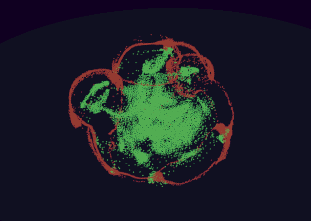

# Particle Life

A particle simulation that creates life-like structures. This is where small simple parts are combined to create a larger more complex structure using simple rules of where particles are either attracted or repelled from each other.

For example, the simulation below has the following rules:
- Red Particles are attracted to Red Particles
- Red Particles are repelled by Green Particles
- Green Particles are attracted to Red Particles
- Green Particles are attracted to Green Particles
- Finally, there is a gravitational force that pushes toward the center. The further a particle is from the center, the more force is applied.

## Optimizations

Since all particles can affect each other, all particles will need to be processed to each other to determine the velocity of each particle. That's a time complexity of O(n^2). The following optimizations have been applied that allow the simulation to run up to 20,000 particles at 60 FPS.
- Use of Spatial Partitioning Technique to dramatically reduce the number of operations needed to determine the velocity of each particle.
- Use of Data Oriented Design principles. Particle data is organized in a contiguous cache-friendly data structure. This organization enables for extremely efficient, deterministic, and scalable use of L1/L2 cache lines, multi-core parallelization, and SIMD.